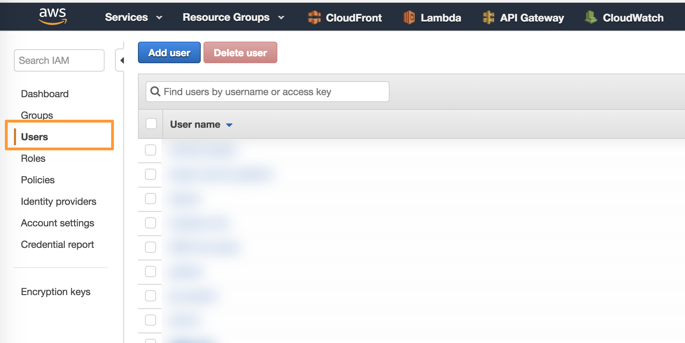
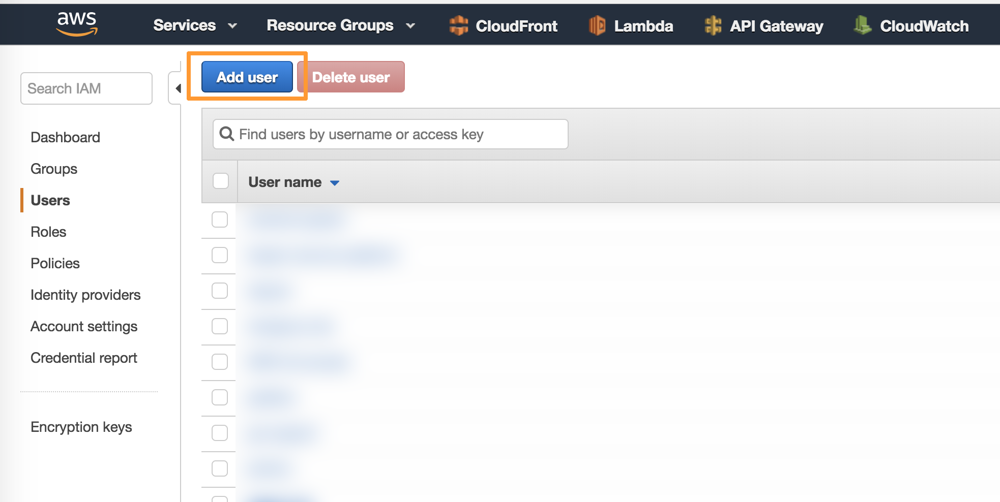
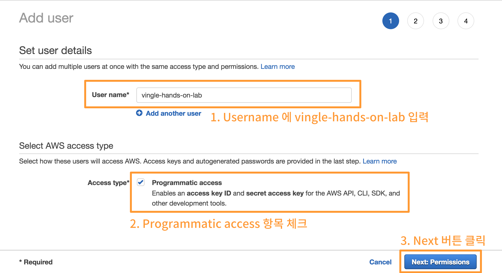
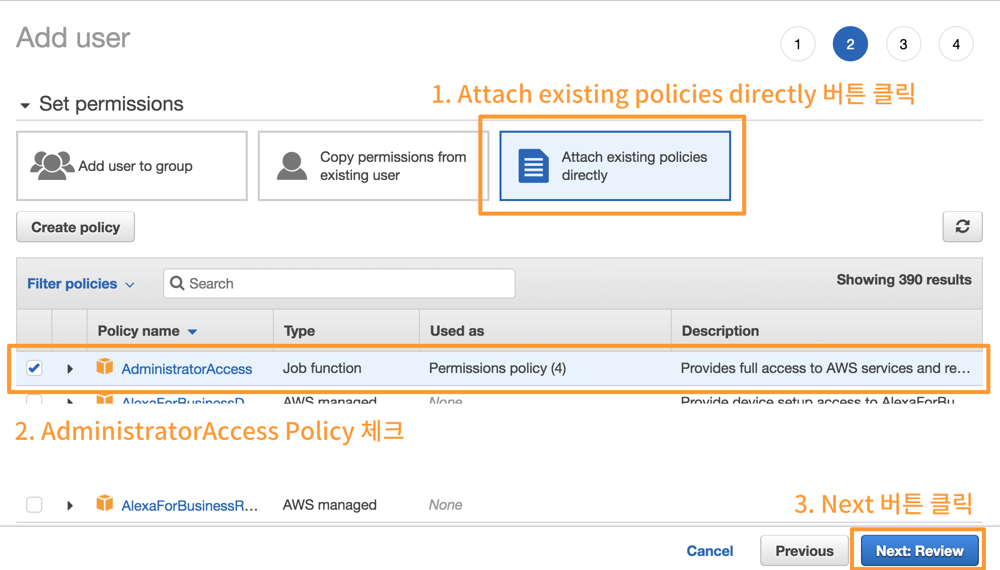
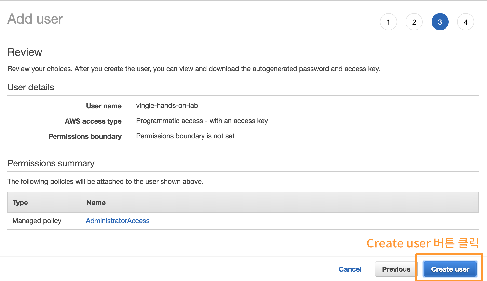
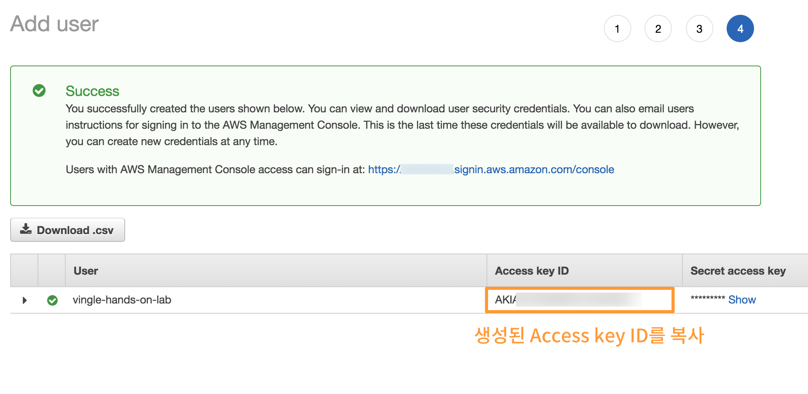
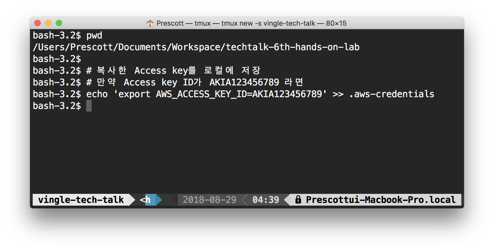
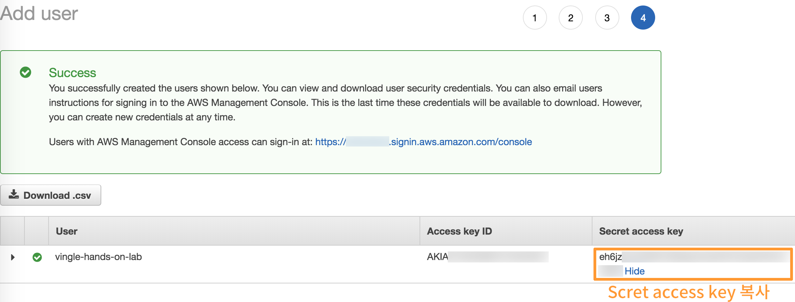
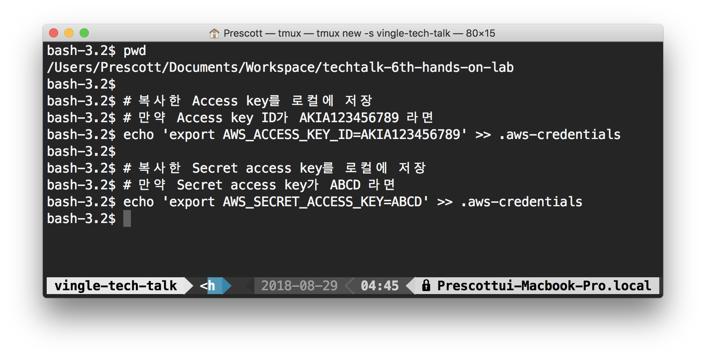

# Vingle Tech Talk 6th Hands-on Lab


## Table of Contents

- [본 세션을 진행하기 위해 필요한 것들](#%EB%B3%B8-%EC%84%B8%EC%85%98%EC%9D%84-%EC%A7%84%ED%96%89%ED%95%98%EA%B8%B0-%EC%9C%84%ED%95%B4-%ED%95%84%EC%9A%94%ED%95%9C-%EA%B2%83%EB%93%A4)
- [개발환경 준비](#%EA%B0%9C%EB%B0%9C%ED%99%98%EA%B2%BD-%EC%A4%80%EB%B9%84)

<br><br><br>

------------

<br><br><br>
 
 
## 본 세션을 진행하기 위해 필요한 것들

- Node.js 6 이상 - [Windows Installer][nodejs-windows-installer] / [macOS Installer][nodejs-macos-installer] / [Linux Installer][nodejs-linux-installer]
- Chrome Browser - [Download][chrome-download]
- Javascript IDE - [Jetbrains WebStorm][webstorm-download] / [Microsoft VSCode][vscode-download]
- Postman - [Download][postman-download]

<br><br><br>

## 개발환경 준비

### 1. 프로젝트 복사

#### Git을 사용할 수 있는 경우

아래 명령과 같이 프로젝트를 복사합니다:

```bash
$ git clone https://github.com/balmbees/techtalk-6th-hands-on-lab.git
```

#### Git을 사용할 수 없는 경우

아래 링크를 통해 압축된 프로젝트를 내려받고, 적절한 위치에 압축을 해제하세요.

[다운로드](https://github.com/balmbees/techtalk-6th-hands-on-lab/archive/master.zip)

<br>

### 2. 프로젝트 의존성 설치

터미널에서 프로젝트 디렉토리로 들어간 후, 아래 명령을 실행해 필요한 의존성들을 설치합니다:

```bash
$ npm install
```


## IAM Credential 준비

> What's IAM?
> 
> (TBD)

[AWS Console][aws-console]에 로그인 후, [IAM Console][iam-console]로 이동하세요.



1. 좌측 패널의 `Users` 링크를 클릭해, Users 패널로 진입합니다.



2. 그 후, 패널 상단의 `Add User` 버튼을 클릭합니다.



3. User name을 입력하는 곳에 `vingle-hands-on-lab` 을 입력합니다,
4. `Programmatic access` 항목을 체크합니다.
5. `Next: Permissions` 버튼을 클릭해 다음 페이지로 넘어갑니다.



6. `Attach existing policies directly` 버튼을 클릭합니다.
7. 리스트에 표시된 항목 중, `AdministratorAccess` 항목을 선택합니다.
8. `Next: Review` 버튼을 클릭합니다. 



9. `Create user` 버튼을 클릭합니다.



10. IAM User 생성이 완료되었습니다. 로컬 환경에서 해당 인증정보를 사용하기 위해, 추가적인 작업이 더 필요합니다. 
11. 생성된 `Access key ID`를 복사합니다.



12. 열어둔 터미널로 되돌아가서, 아래 명령을 실행합니다.

```bash
$ echo 'export AWS_ACCESS_KEY_ID=붙여넣기' >> .aws-credentials
```



13. 다시 브라우저로 돌아가서, 이번에는 `Secret access key`를 복사합니다.
`Secret access key`가 가려져 있는 경우, `Show` 텍스트를 클릭하면 해당 값을 확인할 수 있습니다.




14. 열어둔 터미널로 되돌아가서, 아래 명령을 실행해 인증정보를 저장합니다.

```bash
$ echo 'export AWS_SECRET_ACCESS_KEY=붙여넣기' >> .aws-credentials
```

15. 아래 명령을 실행해 키가 올바른지 저장되었는지 다시 한번 체크합니다.

```bash
$ cat .aws-credentials
```

16. 저장된 인증정보를 아래 명령을 통해 터미널에서 쓸 수 있도록 불러옵니다.

```bash
$ source .aws-credentials 
```

17. IAM 설정이 끝났습니다! 브라우저로 돌아가서, Close 버튼을 눌러 사용자를 추가하는 화면을 닫아주세요.

이제 만들어진 IAM 계정을 통해 필요한 리소스들을 생성하고 접근할 수 있습니다 :)


[nodejs-windows-installer]: https://nodejs.org/dist/v8.11.4/node-v8.11.4-x86.msi
[nodejs-macos-installer]: https://nodejs.org/dist/v8.11.4/node-v8.11.4.pkg
[nodejs-linux-installer]: https://github.com/nodesource/distributions
[chrome-download]: https://www.google.com/chrome/
[webstorm-download]: http://www.jetbrains.com/webstorm/download/
[vscode-download]: https://code.visualstudio.com/download
[postman-download]: https://www.getpostman.com/apps
[aws-console]: https://console.aws.amazon.com/console/home?region=ap-northeast-2
[iam-console]: https://console.aws.amazon.com/iam/home?region=ap-northeast-2

<br><br><br>

## 수집 API 작성
1. 람다로 들어오는 이벤트 payload 가 어떻게 구성되었는지 확인하기 위해 API 로 들어오는 event 를 console.log 로 찍고 아래 명령어로 배포합니다.
```bash
npm run deploy:prod -- --identifier {yournickname(lowercase)}
```

2. 아래 명령을 통해 생성된 API Gateway 주소를 확인합니다.
```bash
$(npm bin)/sls info -r ap-northeast-2 -s prod --identifier {yournickname(lowercase)}
```

3. 확인한 API 주소로 POST 요청을 보냅니다.
    * Postman
    
    * wget
    ```bash
    wget --quiet \
    --method POST \
    --header 'Content-Type: application/json' \
    --header 'accept-language: ko' \
    --header 'Cache-Control: no-cache' \
    --header 'Postman-Token: c8b59152-2c68-4913-a0fb-c7ee9986aa60' \
    --body-data '{\n	"action": "click",\n	"userId": 404444,\n	"buttonName": "helloWorld"\n}' \
    --output-document \
    - {API_ADDRESS}
    ```
    * curl
    ```bash
    curl -X POST \
    {API_ADDRESS} \
    -H 'Cache-Control: no-cache' \
    -H 'Content-Type: application/json' \
    -H 'Postman-Token: 089df995-5dee-431e-930c-e0f83ce9e255' \
    -H 'accept-language: ko' \
    -d '{
     "action": "click",
     "userId": 404444,
     "buttonName": "helloWorld"
    }'
    ```

4. 아래 명령어를 통해 console.log 로 찍어둔 event payload 확인합니다.
```bash
$(npm bin)/sls logs -f collect --startTime 10m --stage prod --identifier {nickname}
```

5. 내부 로직 구현하면서 배포하기 전에 로컬 환경에서 테스트를 하기 위해서 아래 명령어로 로컬 서버를 띄웁니다.
```bash
npm run dev
```

6. handler 내부에 body 로 들어온 payload 를 그대로 kinesis firehose 로 넘기는 로직을 구현합니다.

7. Step3 와 동일한 방법으로 로컬서버로 event payload 를 보냅니다.

8. [Firehose console](https://ap-northeast-2.console.aws.amazon.com/firehose/home?region=ap-northeast-2#/details/DataTracker-prod/monitoring)에 들어가서 전송한 event 가 metrics 에 잘 찍히는지 확인합니다.

9. 확인이 완료되면 [S3 home](https://s3.console.aws.amazon.com/s3/home?region=ap-northeast-2)에 들어가서 {identifier}-google-analytics 라고 되어있는 bucket으로 들어갑니다.

10. 해당 버킷에 들어있는 파일을 다운받고 .gz 확장자를 .json 으로 바꿔준 열어주고 아까 보냈던 payload 가 정상적으로 들어있는지 확인합니다.

11. 로컬에서 변경한 내용을 아래 명령어를 통해 Lambda 로 배포합니다.
```bash
npm run deploy:prod -- --identifier {yournickname(lowercase)}
```


